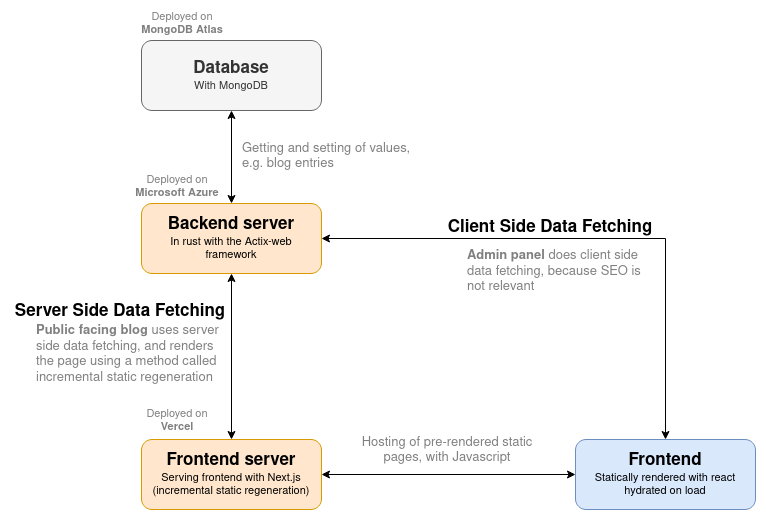

# personal-website-backend

The backend for my personal website. Live at [monolith.vision](https://monolith.vision). This server is purely backend, and doesn't serve the frontend at all. It acts as an API to store and serve my blog pages to the frontend, which is hosted on a seperate server and [repo](https://github.com/monlih/personal-website-frontend).

A flowchart showing the architecture of my personal website:


## Setup + Run

- Install rust toolchain
- Have GNU `make`
- Get access to a mongodb server
- Fill in `.env.example` with mongodb credentials and admin `key` and move it to `.env`
- Finally, run:

```bash
make build
make run
```

P.S: I know I should make a `dockerfile`, but I'll do that later.
